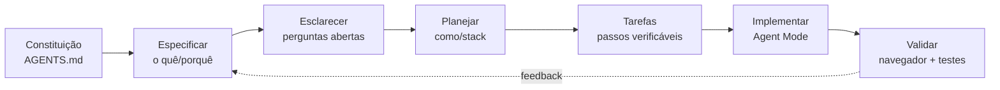

# Trilha SDD: Spec-Driven Development no VS Code

[📚 Referência Rápida](GUIDE.md)

---

Bem-vindo à **Trilha SDD** do Pokédex Agent Lab — um curso prático onde você aprende **Spec-Driven Development (SDD)**: um jeito de desenvolver com IA em que a **especificação vira a fonte da verdade**, e não um rascunho descartável.

Em vez de "vibe coding" (mandar prompts soltos e torcer), você vai estruturar o desenvolvimento em fases claras — **constituição → especificação → plano → tarefas → implementação** — usando apenas os **primitivos nativos do VS Code + GitHub Copilot**: `AGENTS.md`, arquivos de instruções, prompt files e custom agents.

> 💡 **De onde vem isso:** A metodologia é inspirada no [Spec Kit](https://github.com/github/spec-kit) do GitHub. Aqui, em vez de instalar a CLI `specify`, recriamos o mesmo fluxo com recursos que já vêm no VS Code — assim você entende *como a coisa funciona por dentro* e leva esse conhecimento para qualquer projeto.

---

## 📋 Checklist Rápido

- [ ] Ter o VS Code **v1.120+** instalado
  - [ ] Certifique-se de que as atualizações automáticas não estão desativadas
- [ ] Estar logado com o GitHub (contas Copilot Free não conseguem usar o agente na nuvem!)
- [ ] Ter o Git e o Node.js 22+ instalados
- [ ] Abrir o Painel do Chat e deixar o Modo Agente ativo e pronto
- [ ] Rodar o app uma vez com `npm install && npm run dev`

*Opcional*: Use DevContainer ou Codespaces.

---

## 🤔 O Que é Spec-Driven Development?

No desenvolvimento tradicional, o código é o rei e a especificação é só um andaime que jogamos fora quando "o trabalho de verdade" (codar) começa. O SDD inverte isso: **a especificação é executável** e gera a implementação, em vez de apenas guiá-la.

| Vibe coding (prompt solto) | Spec-Driven Development |
|---|---|
| "Faz um filtro aí" | Spec descreve **o quê** e **por quê**, com critérios de aceite |
| IA adivinha a arquitetura | Plano define **como** e qual stack |
| Resultado imprevisível | Tarefas pequenas e verificáveis |
| Difícil revisar/repetir | Artefatos versionados e reutilizáveis |

---

## 🎯 O Que Você Vai Aprender

| # | Habilidade | Descrição |
|---|------------|-----------|
| 1 | **Fundamentos do SDD** | A `AGENTS.md` como constituição e o ciclo spec → plano → tarefas → implementação |
| 2 | **Estruturação de Contexto** | Camadas de regras com `AGENTS.md`, instructions escopadas e prompt files |
| 3 | **Workflows Reutilizáveis** | Uma biblioteca de prompt files que reproduz o fluxo do Spec Kit |
| 4 | **Escala com Agentes** | Custom agents especializados, padronização e colaboração em time |

---

## 📚 Sessões do Curso

| Sessão | Título | Descrição | Tempo |
|--------|--------|-----------|-------|
| [**01**](01-fundamentos.md) | Fundamentos do Spec-Driven Development | Crie a `AGENTS.md` e rode seu primeiro ciclo SDD ponta a ponta | ~30 min |
| [**02**](02-estrutura.md) | Estruturando o Contexto | Organize regras em camadas: `AGENTS.md`, instructions e prompt files | ~30 min |
| [**03**](03-workflows.md) | Workflows Reutilizáveis de SDD | Construa a biblioteca specify → plan → tasks → implement | ~35 min |
| [**04**](04-escala.md) | Escalando o SDD com Agentes | Orquestre custom agents e padronize o SDD em time | ~35 min |
| [**05**](05-conclusao.md) | Conclusão | Revise tudo o que você construiu e os próximos passos | ~5 min |

---

## 🔁 O Ciclo SDD (visão geral)

Cada sessão aprofunda uma fase desse ciclo e o aplica a uma **funcionalidade nova** da Pokédex.

---

## 🐾 O Que Vamos Construir

Cada sessão evolui a Pokédex com uma feature pensada para o fluxo SDD:

| Sessão | Funcionalidade | Por que é boa para SDD |
|--------|----------------|------------------------|
| 01 | Alternância de sprite **Shiny** ✨ | Pequena e completa — ideal para ver o ciclo inteiro |
| 02 | **Filtro avançado por tipo** | Regras de negócio claras para escopar instructions |
| 03 | **Comparador de stats** lado a lado | Bom para reusar o mesmo workflow em feature, refactor e docs |
| 04 | **Simulador de batalha** (vantagem de tipo) | Lógica testável que pede orquestração de agentes |

---

## 💡 Dicas

1. Mantenha o navegador aberto ao lado do VS Code para ver o app rodando em tempo real
2. Faça commit dos **artefatos de spec** (`specs/`) junto com o código — eles são parte da entrega
3. Use os **Checkpoints** e o *Undo Last Action* do Copilot para recuperar de mudanças indesejadas
4. Releia a spec sempre que o agente "fugir do escopo" — quase sempre o problema está na spec

---

## 🔗 Recursos Adicionais

- [Spec Kit (GitHub)](https://github.com/github/spec-kit) — a metodologia original
- [Metodologia completa do SDD](https://github.com/github/spec-kit/blob/main/spec-driven.md)
- [Customizar o Copilot no VS Code](https://code.visualstudio.com/docs/copilot/copilot-customization)
- [Awesome Copilot](https://github.com/github/awesome-copilot) — instruções, prompts e agents da comunidade
- [Documentação da PokéAPI](https://pokeapi.co/docs/v2) — a API REST que alimenta este app

---

👉 Comece pela **[Sessão 01: Fundamentos do Spec-Driven Development](01-fundamentos.md)**
