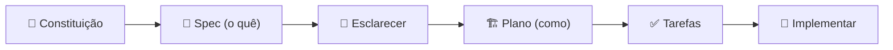

# Sessão 01: Fundamentos do Spec-Driven Development

[← Visão Geral](00-overview.md)

---

Nesta sessão você vai entender por que a **especificação vira a fonte da verdade** no desenvolvimento com IA, criar a **constituição** do projeto (`AGENTS.md`) e rodar seu **primeiro ciclo SDD completo** — do *o quê* até o código funcionando — implementando uma alternância de sprite **Shiny** ✨ na Pokédex.

> 🎥 Esta é a Sessão 1 da trilha. Foco: fundamentos, `AGENTS.md` e o ciclo `specify → plan → tasks → implement`.

---

## 🎯 O Que Você Vai Aprender

- A diferença prática entre **prompt solto** e **desenvolvimento estruturado por spec**
- Como escrever uma **constituição** de projeto com `AGENTS.md`
- Como executar o ciclo SDD manualmente, fase a fase, dentro do chat
- Como validar a entrega com o navegador

---

## 🧠 Conceito: Por Que Spec-Driven?

Quando você manda um prompt como *"adiciona um botão de shiny aí"*, o agente precisa **adivinhar** dezenas de decisões: onde fica o botão, como persiste, o que acontece se não houver sprite shiny, qual o estilo. Cada adivinhação é uma chance de erro.

No SDD, separamos o trabalho em fases para que cada decisão seja **explícita e revisável**:



> 💡 **Lição:** A spec não é burocracia — é a forma de **transferir intenção** para a IA com precisão. Uma boa spec elimina retrabalho.

---

## 📜 Tarefa 1: Criar a Constituição do Projeto (`AGENTS.md`)

A `AGENTS.md` é lida automaticamente pelo Copilot e vale para **todas** as interações. É o equivalente nativo ao `/speckit.constitution`.

**Passos:**

1. Garanta que o app roda:
   ```bash
   npm install
   npm run dev
   ```
2. (Opcional) Gere uma base automática para acelerar:
   ```
   /init
   ```
3. Crie o arquivo `AGENTS.md` na **raiz** do projeto com o seguinte conteúdo:

   ```markdown
   # Pokédex Agent Lab — Constituição

   ## Princípios
   1. A especificação é a fonte da verdade. Código segue a spec, não o contrário.
   2. Mudanças pequenas e verificáveis. Nada de "big bang".
   3. Toda feature nova nasce de uma spec em `specs/<feature>/`.
   4. Acessibilidade e responsividade não são opcionais.

   ## Stack e Convenções
   - Next.js 15 (App Router) + React 19 + TypeScript estrito
   - Tailwind CSS para estilo (sem CSS inline; sem libs de UI externas)
   - Dados via PokéAPI; tipos centralizados em `src/lib/types.ts`
   - Cores de tipo em `src/lib/constants.ts` (TYPE_COLORS)

   ## Fluxo de Trabalho (SDD)
   - specify → clarify → plan → tasks → implement
   - Cada fase gera um artefato versionado em `specs/<feature>/`

   ## Checklist Obrigatório Antes de Concluir
   - [ ] `npm run lint` sem erros
   - [ ] `npm run build` passa
   - [ ] Validado no navegador em http://localhost:3000
   ```
4. Faça **commit** do arquivo.

✅ **Resultado:** Todas as próximas interações do agente passam a respeitar esses princípios automaticamente.

> 💡 **Pense sobre:** Quais regras do seu time real você gostaria que a IA *nunca* esquecesse? Essas regras pertencem à `AGENTS.md`.

---

## 📝 Tarefa 2: Especificar a Feature (o QUÊ e o PORQUÊ)

Vamos construir a **alternância de sprite Shiny**: um botão que troca o sprite normal pelo shiny em cada card.

**Passos:**

1. No Modo Agente, envie:
   ```markdown
   Crie uma especificação em `specs/shiny-toggle/spec.md` para uma feature de
   alternância de sprite Shiny na Pokédex. Foque no QUÊ e no PORQUÊ, sem citar
   tecnologia. Inclua: objetivo, histórias de usuário, critérios de aceite e
   itens fora de escopo. Marque dúvidas com [NEEDS CLARIFICATION].
   ```
2. Revise o `spec.md` gerado. Um bom resultado se parece com:

   ```markdown
   # Spec: Alternância de Sprite Shiny

   ## Objetivo
   Permitir que a pessoa visualize a versão shiny (coloração rara) de cada
   Pokémon, aumentando a diversão e o senso de descoberta.

   ## Histórias de Usuário
   - Como usuário, quero alternar entre sprite normal e shiny em um card.
   - Como usuário, quero que minha preferência de shiny persista ao recarregar.

   ## Critérios de Aceite
   - [ ] Cada card tem um controle visível de alternância ✨
   - [ ] Ao ativar, o card mostra o sprite shiny; ao desativar, o normal
   - [ ] Se não houver sprite shiny, o controle fica desabilitado
   - [ ] A preferência persiste entre sessões

   ## Fora de Escopo
   - Animações de sprite
   - Alternância global (só por card nesta versão)
   ```

✅ **Resultado:** A intenção está documentada e revisável **antes** de qualquer código.

---

## 🤔 Tarefa 3: Esclarecer e Planejar (o COMO)

**Passos:**

1. Se houver `[NEEDS CLARIFICATION]`, responda no chat até zerá-los.
2. Mude para o **Plan Mode** (seletor de modo do chat) e envie:
   ```markdown
   Com base em specs/shiny-toggle/spec.md, gere specs/shiny-toggle/plan.md com:
   - decisões técnicas (componentes/arquivos afetados)
   - como persistir a preferência (localStorage)
   - riscos e edge cases (Pokémon sem sprite shiny)
   Use nossa stack: Next.js, TypeScript, Tailwind.
   ```
3. Revise o plano. Ele deve citar arquivos concretos como
   [src/app/components/PokemonCard.tsx](../../src/app/components/PokemonCard.tsx) e os campos de sprite da PokéAPI.

> 💡 **Lição:** O **Plan Mode** é o lugar natural para a fase de *clarify* e *plan* do SDD — ele pensa antes de escrever código e você refina o plano sem custo.

---

## ✅ Tarefa 4: Tarefas e Implementação

**Passos:**

1. Ainda no chat, gere a lista de tarefas:
   ```markdown
   Gere specs/shiny-toggle/tasks.md como uma checklist de passos pequenos e
   verificáveis a partir do plan.md, em ordem de execução.
   ```
2. Volte ao **Modo Agente** e mande implementar seguindo as tarefas:
   ```markdown
   Implemente a feature shiny seguindo specs/shiny-toggle/tasks.md, marcando
   cada tarefa como concluída ao final. Respeite a AGENTS.md.
   ```
3. Valide no navegador: ative o ✨ em alguns cards, recarregue e confira a persistência.
4. Rode o checklist da constituição:
   ```bash
   npm run lint
   npm run build
   ```

✅ **Resultado:** A feature shiny nasceu de uma spec, passou por um plano, virou tarefas e foi implementada de forma rastreável.

---

## 🧪 Checkpoint

- [ ] `AGENTS.md` criado e commitado
- [ ] `specs/shiny-toggle/spec.md`, `plan.md` e `tasks.md` gerados
- [ ] Botão shiny funciona e persiste no navegador
- [ ] `npm run build` passa

---

## ✅ Sessão 01 Concluída!

Você aprendeu a:
- Diferenciar prompt solto de desenvolvimento estruturado por spec
- Escrever a **constituição** do projeto com `AGENTS.md`
- Rodar o ciclo **specify → clarify → plan → tasks → implement** manualmente
- Validar a entrega com o navegador e o checklist da constituição

👉 Continue na **[Sessão 02: Estruturando o Contexto](02-estrutura.md)** para transformar esse fluxo manual em um setup modular e reutilizável.
