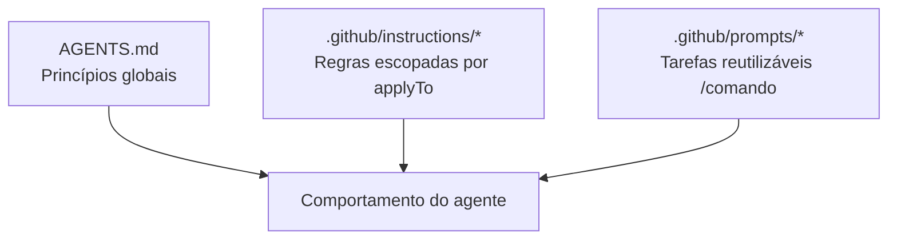

# Sessão 02: Estruturando o Contexto — AGENTS.md, Instructions e Prompt Files

[← Sessão 01](01-fundamentos.md)

---

Na Sessão 01 você rodou o ciclo SDD **manualmente**. Agora vamos **estruturar o contexto em camadas** para que esse fluxo seja consistente, modular e reutilizável. Você vai dividir as regras entre `AGENTS.md` (princípios globais), **instructions escopadas** (regras por tipo de arquivo) e **prompt files** (tarefas reutilizáveis) — e aplicar tudo construindo um **filtro avançado por tipo** na Pokédex.

> 🎥 Esta é a Sessão 2 da trilha. Foco: organizar o comportamento da IA em camadas e definir responsabilidades.

---

## 🎯 O Que Você Vai Aprender

- As **três camadas de contexto** do VS Code e quando usar cada uma
- Como escopar regras com `applyTo` para não poluir todo o projeto
- Como criar seu **primeiro prompt file** reutilizável (`/specify`)
- Como aplicar o setup modular a uma feature real

---

## 🧱 Conceito: As Três Camadas de Contexto



| Camada | Escopo | Exemplo |
|--------|--------|---------|
| `AGENTS.md` | Sempre ativo, projeto todo | "A spec é a fonte da verdade" |
| Instructions | Arquivos que casam com `applyTo` | "Em `*.tsx`, use Tailwind" |
| Prompt files | Sob demanda, via `/comando` | "/specify gera uma spec" |

> 💡 **Lição:** Colocar *tudo* na `AGENTS.md` deixa o contexto inchado e genérico. Regras específicas pertencem a **instructions escopadas**; ações repetíveis pertencem a **prompt files**.

---

## 🗂️ Tarefa 1: Escopar Regras com Instructions

Vamos tirar as regras específicas de React/TypeScript da `AGENTS.md` e movê-las para instructions escopadas.

**Passos:**

1. Crie `.github/instructions/react.instructions.md`:
   ```markdown
   ---
   applyTo: "src/**/*.tsx"
   ---
   - Componentes funcionais com hooks; sem classes
   - Estilização exclusivamente com Tailwind (sem CSS inline)
   - Estados de UI derivados ficam em hooks dedicados em `src/lib/`
   - Toda interação clicável precisa de `aria-label` e foco visível
   ```
2. Crie `.github/instructions/testing.instructions.md`:
   ```markdown
   ---
   applyTo: "src/**/*.{test,spec}.ts"
   ---
   - Jest + Testing Library
   - Um `describe` por função pública; casos de borda explícitos
   - Sem mocks de rede em testes de lógica pura
   ```
3. Crie `.github/instructions/sdd.instructions.md`:
   ```markdown
   ---
   applyTo: "specs/**/*.md"
   ---
   - Specs descrevem o QUÊ e o PORQUÊ, nunca o COMO
   - Sempre inclua "Critérios de Aceite" e "Fora de Escopo"
   - Marque incertezas com [NEEDS CLARIFICATION]
   ```
4. Enxugue a `AGENTS.md`: mantenha só os princípios globais e remova o que migrou para instructions.

✅ **Resultado:** Cada regra agora vive na camada certa e só "acende" quando relevante.

> 💡 **Pense sobre:** O `applyTo` evita que a IA aplique regra de teste em arquivo de componente. Quais glob patterns fariam sentido nos seus projetos?

---

## ⚙️ Tarefa 2: Criar Seu Primeiro Prompt File (`/specify`)

Na Sessão 01 você digitou o prompt de especificação na mão. Vamos transformá-lo em um **comando reutilizável**.

**Passos:**

1. Rode `Chat: New Prompt File` (ou crie manualmente) em `.github/prompts/specify.prompt.md`:
   ```markdown
   ---
   mode: agent
   description: Gera uma especificação SDD a partir de uma ideia de feature
   ---
   Você é um analista de produto sênior praticando Spec-Driven Development.

   A partir da ideia descrita pelo usuário:
   1. Deduza um nome curto em kebab-case para a feature.
   2. Crie `specs/<feature>/spec.md` contendo:
      - **Objetivo** (o porquê, em 1-2 frases)
      - **Histórias de Usuário**
      - **Critérios de Aceite** (checklist verificável)
      - **Fora de Escopo**
   3. Foque no QUÊ e no PORQUÊ. Não cite stack, arquivos ou bibliotecas.
   4. Marque qualquer incerteza com [NEEDS CLARIFICATION: pergunta].

   Ao final, liste as clarificações pendentes para o usuário responder.
   ```
2. Teste digitando no chat:
   ```
   /specify Um filtro que permite mostrar apenas Pokémon de um ou mais tipos selecionados
   ```
3. Confira que ele gerou `specs/type-filter/spec.md` no formato esperado.

✅ **Resultado:** A fase *specify* virou um comando de uma linha, consistente para qualquer feature.

---

## 🎨 Tarefa 3: Aplicar o Setup ao Filtro por Tipo

Agora use o fluxo estruturado para entregar a feature.

**Passos:**

1. Responda eventuais `[NEEDS CLARIFICATION]` da spec gerada na Tarefa 2.
2. No **Plan Mode**, peça o plano:
   ```markdown
   Gere specs/type-filter/plan.md a partir do spec.md. Considere as cores e a
   lista de tipos em src/lib/constants.ts e o estado atual de filtragem em
   src/app/components/PokedexApp.tsx.
   ```
3. Gere as tarefas e implemente no **Modo Agente**:
   ```markdown
   Gere specs/type-filter/tasks.md e implemente o filtro por tipo seguindo as
   tarefas. Use os chips de tipo com as cores de TYPE_COLORS. Respeite as
   instructions de React.
   ```
4. Valide no navegador: selecione um ou mais tipos e confirme que a grade filtra corretamente, inclusive combinado com a busca existente.

✅ **Resultado:** Uma feature real entregue com regras escopadas e um prompt file reutilizável.

> 💡 **Lição:** Repare como você **não repetiu** as regras de Tailwind/acessibilidade no prompt — elas vieram automaticamente das instructions escopadas. Esse é o ganho do contexto em camadas.

---

## 🧪 Checkpoint

- [ ] 3 arquivos de instructions criados com `applyTo`
- [ ] `AGENTS.md` enxuta (só princípios globais)
- [ ] `.github/prompts/specify.prompt.md` funcionando via `/specify`
- [ ] Filtro por tipo funcionando no navegador

---

## ✅ Sessão 02 Concluída!

Você aprendeu a:
- Distribuir regras entre `AGENTS.md`, instructions escopadas e prompt files
- Usar `applyTo` para acionar regras só onde fazem sentido
- Criar seu primeiro **prompt file reutilizável** (`/specify`)
- Entregar uma feature reaproveitando todo o contexto estruturado

👉 Continue na **[Sessão 03: Workflows Reutilizáveis de SDD](03-workflows.md)** para construir a biblioteca completa specify → plan → tasks → implement.
