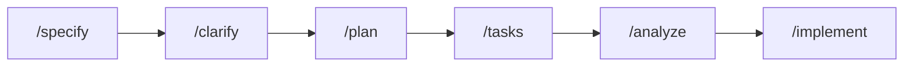

# Sessão 03: Workflows Reutilizáveis de SDD — specify → plan → tasks → implement

[← Sessão 02](02-estrutura.md)

---

Você já tem o `/specify`. Nesta sessão vamos completar a **biblioteca de prompt files** que reproduz o fluxo do Spec Kit inteiro e provar seu valor aplicando **o mesmo workflow** a três cenários diferentes: uma **feature nova** (comparador de stats), uma **refatoração** e uma **documentação**.

> 🎥 Esta é a Sessão 3 da trilha. Foco: previsibilidade e eficiência com workflows reutilizáveis.

---

## 🎯 O Que Você Vai Aprender

- Como construir uma **prompt library** coesa (`/specify`, `/clarify`, `/plan`, `/tasks`, `/analyze`, `/implement`)
- Como encadear prompt files em um workflow previsível
- Como o **mesmo workflow** serve para feature, refactor e docs
- Como usar `/analyze` para garantir consistência antes de codar

---

## 🏗️ Conceito: Workflow como Produto

Um workflow reutilizável transforma conhecimento tácito ("como a gente faz feature aqui") em **comandos versionados** que qualquer pessoa do time executa do mesmo jeito.



> 💡 **Lição:** Previsibilidade é o objetivo. Quando o processo é um comando, o resultado para de depender de quem digitou o prompt.

---

## 📦 Tarefa 1: Completar a Biblioteca de Prompt Files

Crie os arquivos abaixo em `.github/prompts/`.

**`clarify.prompt.md`**
```markdown
---
mode: agent
description: Faz perguntas para eliminar ambiguidades de uma spec
---
Leia a spec mais recente em `specs/<feature>/spec.md`. Liste de 3 a 7
perguntas objetivas que precisam de resposta antes de planejar. Foque em
regras de negócio, edge cases e critérios de aceite ambíguos. Não escreva
código nem altere arquivos.
```

**`plan.prompt.md`**
```markdown
---
mode: agent
description: Cria o plano técnico a partir de uma spec aprovada
---
A partir de `specs/<feature>/spec.md`, gere `specs/<feature>/plan.md` com:
- Decisões técnicas e arquivos afetados (caminhos reais do repo)
- Estruturas de dados/tipos novos
- Riscos, edge cases e estratégia de teste
Respeite a stack do projeto (Next.js, TypeScript, Tailwind). Não implemente.
```

**`tasks.prompt.md`**
```markdown
---
mode: agent
description: Quebra o plano em tarefas pequenas e verificáveis
---
A partir de `specs/<feature>/plan.md`, gere `specs/<feature>/tasks.md` como
uma checklist ordenada. Cada tarefa deve ser pequena, independente e ter um
critério de "pronto" claro. Marque tarefas paralelizáveis com [P].
```

**`analyze.prompt.md`**
```markdown
---
mode: agent
description: Verifica consistência entre spec, plan e tasks
---
Compare `spec.md`, `plan.md` e `tasks.md` da feature indicada. Aponte:
- Critérios de aceite sem tarefa correspondente
- Tarefas sem respaldo na spec (escopo extra)
- Contradições ou lacunas
Produza um relatório curto. Não altere código.
```

**`implement.prompt.md`**
```markdown
---
mode: agent
description: Executa as tarefas e implementa a feature
---
Implemente a feature seguindo `specs/<feature>/tasks.md`, na ordem. Após cada
tarefa, marque-a como concluída no arquivo. Respeite a AGENTS.md e as
instructions. Ao final, rode o checklist obrigatório da constituição.
```

✅ **Resultado:** Um pipeline SDD completo, todo acionável por comandos.

---

## ⚔️ Tarefa 2: Cenário A — Nova Feature (Comparador de Stats)

Vamos exercitar o workflow ponta a ponta numa feature nova: comparar dois Pokémon lado a lado.

**Passos:**

1. ```text
   /specify Comparar dois Pokémon lado a lado, mostrando stats base (HP, ataque,
   defesa, etc.) e destacando qual vence em cada atributo
   ```
2. `/clarify` → responda as perguntas.
3. `/plan` → revise os arquivos afetados (provável novo componente `ComparePanel.tsx` e uso de [src/lib/types.ts](../../src/lib/types.ts)).
4. `/tasks` → revise a checklist.
5. `/analyze` → corrija qualquer inconsistência apontada.
6. `/implement` → deixe o agente construir.
7. Valide no navegador: selecione dois Pokémon e confira o destaque de vencedor por atributo.

✅ **Resultado:** Feature entregue sem você escrever um único prompt ad-hoc.

---

## 🔧 Tarefa 3: Cenário B — Refatoração

O **mesmo** workflow vale para mudanças internas. Specs também documentam *intenção de refatorar*.

**Passos:**

1. ```text
   /specify Centralizar toda a busca de dados da PokéAPI em src/lib/api.ts,
   removendo fetch duplicado dos componentes, sem mudar comportamento visível
   ```
2. `/plan` → o plano deve mapear cada chamada `fetch` espalhada e o destino em [src/lib/api.ts](../../src/lib/api.ts).
3. `/tasks` → `/analyze` → `/implement`.
4. Garanta que nada mudou para o usuário: rode o app e os testes.
   ```bash
   npm test
   npm run build
   ```

> 💡 **Lição:** Em refatoração, o critério de aceite mais importante é "**comportamento idêntico**". A spec explicita isso e o `/analyze` cobra que as tarefas preservem o comportamento.

---

## 📖 Tarefa 4: Cenário C — Documentação

Workflows reutilizáveis também produzem documentação consistente.

**Passos:**

1. Crie um prompt file dedicado `.github/prompts/document.prompt.md`:
   ```markdown
   ---
   mode: agent
   description: Documenta um módulo ou feature existente
   ---
   Documente o alvo indicado pelo usuário. Gere/atualize um README de seção
   com: propósito, API pública, exemplos de uso e decisões de design. Baseie-se
   no código real; não invente comportamento.
   ```
2. Use-o:
   ```text
   /document Gere docs para src/lib/api.ts explicando cada função exportada e
   o contrato de dados da PokéAPI
   ```
3. Revise e ajuste o resultado.

✅ **Resultado:** O mesmo padrão SDD entregou feature, refatoração e documentação — com previsibilidade.

---

## 🧪 Checkpoint

- [ ] Biblioteca de prompt files completa em `.github/prompts/`
- [ ] Comparador de stats funcionando no navegador
- [ ] Refatoração da camada de API concluída sem mudança de comportamento
- [ ] Documentação gerada para `src/lib/api.ts`

---

## ✅ Sessão 03 Concluída!

Você aprendeu a:
- Construir uma **prompt library** que reproduz o fluxo do Spec Kit
- Encadear `/specify → /clarify → /plan → /tasks → /analyze → /implement`
- Reaproveitar o **mesmo workflow** para feature, refactor e docs
- Usar `/analyze` para travar inconsistências antes de implementar

👉 Continue na **[Sessão 04: Escalando o SDD com Agentes](04-escala.md)** para levar esses workflows a um cenário colaborativo com custom agents.
