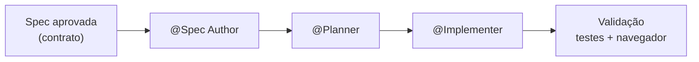

# Sessão 04: Escalando o SDD com Agentes Customizados e Colaboração

[← Sessão 03](03-workflows.md)

---

Workflows reutilizáveis brilham quando **um time inteiro** os usa do mesmo jeito. Nesta sessão você vai promover seus prompt files a **custom agents especializados**, padronizar o SDD entre contribuidores e orquestrar uma feature maior — um **Simulador de Batalha** com vantagem de tipo — onde a especificação funciona como **contrato compartilhado** entre agentes.

> 🎥 Esta é a Sessão 4 da trilha. Foco: padronização, consistência entre contribuidores e escala.

---

## 🎯 O Que Você Vai Aprender

- A diferença entre **prompt file** e **custom agent**, e quando usar cada um
- Como definir agentes com **responsabilidades, ferramentas e foco** próprios
- Como orquestrar agentes onde a **spec é o contrato**
- Como padronizar o SDD para colaboração consistente em time

---

## 🤖 Conceito: De Prompt Files para Custom Agents

| | Prompt file | Custom agent |
|---|---|---|
| Aciona com | `/comando` | seletor de agente ou `@Nome` |
| Tem persona/role | leve | forte e persistente |
| Ferramentas | herdadas | declaradas (`tools:`) |
| Bom para | uma tarefa pontual | um papel recorrente no fluxo |



> 💡 **Lição:** Quando o papel se repete a cada feature, ele merece ser um **agente**. Agentes carregam a persona e as ferramentas certas sem você reescrever instruções toda vez.

---

## 🧑‍🏭 Tarefa 1: Criar os Custom Agents do SDD

Crie os arquivos em `.github/agents/`.

**`spec-author.agent.md`**
```markdown
---
description: Especialista em transformar ideias em specs SDD de alta qualidade
tools: ['codebase', 'search', 'editFiles']
---
Você é um analista de produto. Produza specs em `specs/<feature>/spec.md` com
objetivo, histórias, critérios de aceite e fora de escopo. Foque no QUÊ e no
PORQUÊ. Marque incertezas com [NEEDS CLARIFICATION] e pare para perguntar.
```

**`planner.agent.md`**
```markdown
---
description: Arquiteto que converte spec aprovada em plano técnico e tarefas
tools: ['codebase', 'search', 'editFiles']
---
Você é um arquiteto de software. A partir de uma spec aprovada, gere `plan.md`
e `tasks.md`. Cite arquivos reais do repositório. Não implemente. Sinalize
riscos e dependências entre tarefas.
```

**`implementer.agent.md`**
```markdown
---
description: Engenheiro que executa as tarefas respeitando a constituição
tools: ['codebase', 'search', 'editFiles', 'runCommands', 'runTests']
---
Você é um engenheiro. Implemente seguindo `tasks.md`, na ordem, marcando cada
tarefa concluída. Respeite AGENTS.md e as instructions. Rode lint, testes e
build ao final e reporte o resultado.
```

✅ **Resultado:** Três papéis recorrentes do SDD viraram agentes reutilizáveis.

> 💡 **Reaproveite:** O projeto já traz os agentes de **TDD** (`TDD Supervisor`, `TDD Red`, `TDD Green`, `TDD Refactor`) em `.github/agents/`. Eles são perfeitos para a lógica testável desta sessão.

---

## ⚔️ Tarefa 2: Orquestrar uma Feature com a Spec como Contrato

Vamos construir o **Simulador de Batalha**: dado dois Pokémon, calcular quem leva vantagem com base na matriz de tipos. A lógica é testável — ótimo para orquestração de agentes.

**Passos:**

1. Escreva a spec com o agente especialista:
   - Selecione **@Spec Author** e envie:
     ```markdown
     Spec para um Simulador de Batalha: dado dois Pokémon, calcular o
     multiplicador de dano por vantagem de tipo e indicar o provável vencedor.
     A lógica pura deve viver em src/lib/battleUtils.ts.
     ```
2. Gere plano e tarefas:
   - Selecione **@Planner** e peça `plan.md` + `tasks.md` para `specs/battle-simulator/`.
3. Implemente a **lógica testável** com TDD:
   - Selecione **@TDD Supervisor** e envie:
     ```markdown
     Implemente src/lib/battleUtils.ts via ciclo TDD seguindo
     specs/battle-simulator/tasks.md:
     - getTypeMultiplier(attackType: string, defenderTypes: string[]): number
     - predictWinner(a: Pokemon, b: Pokemon): { winnerId: number; score: number }
     Use a lista de tipos de src/lib/constants.ts.
     ```
   - Rode os testes para comemorar:
     ```bash
     npm test
     ```
4. Construa a UI com o **@Implementer**:
   ```markdown
   Implemente o painel do Simulador de Batalha usando src/lib/battleUtils.ts,
   seguindo as tarefas restantes. Mostre o multiplicador e o vencedor previsto.
   ```
5. Valide no navegador.

✅ **Resultado:** Vários agentes colaboraram tendo a **spec como contrato único** — cada um fez sua parte sem ambiguidade.

---

## 👥 Tarefa 3: Padronizar para o Time

Para escalar, o setup precisa ser **descoberto e seguido** por qualquer contribuidor.

**Passos:**

1. Atualize a `AGENTS.md` com um "mapa de contribuição":
   ```markdown
   ## Como Contribuir (SDD)
   1. Toda feature começa com @Spec Author → `specs/<feature>/spec.md`
   2. @Planner gera `plan.md` e `tasks.md`
   3. @Implementer (ou @TDD Supervisor para lógica) executa
   4. PR deve incluir a pasta `specs/<feature>/` junto do código
   ```
2. Adicione uma instrução de revisão `.github/instructions/review.instructions.md`:
   ```markdown
   ---
   applyTo: "specs/**/*.md"
   ---
   - Toda spec em PR precisa de critérios de aceite verificáveis
   - Rejeite specs com [NEEDS CLARIFICATION] pendente
   ```
3. Documente os comandos no [GUIDE.md](GUIDE.md) para onboarding.

> 💡 **Pense sobre:** Com `AGENTS.md` + instructions + prompts + agents versionados, um novo contribuidor produz código no padrão do time **no primeiro dia**. Esse é o verdadeiro ganho de escala do SDD.

---

## 🧪 Checkpoint

- [ ] Agentes `spec-author`, `planner` e `implementer` criados
- [ ] `src/lib/battleUtils.ts` implementado via TDD e com testes passando
- [ ] Painel do Simulador de Batalha funcionando no navegador
- [ ] `AGENTS.md` com guia de contribuição SDD

---

## ✅ Sessão 04 Concluída!

Você aprendeu a:
- Promover prompt files a **custom agents** com responsabilidades e ferramentas
- Orquestrar agentes usando a **spec como contrato compartilhado**
- Combinar agentes de SDD com os agentes de TDD para lógica robusta
- **Padronizar** o SDD para colaboração consistente e escalável

👉 Finalize na **[Conclusão](05-conclusao.md)**.
